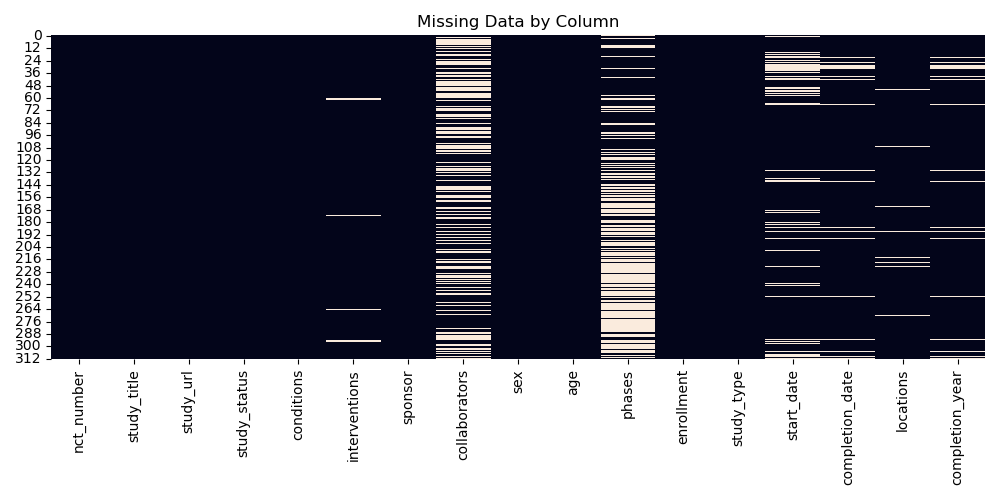

# 🧪 Clinical Trial Data Analysis

Welcome! This is a personal project to simulate real-world biostatistics work using open clinical data.

## 📊 What This Project Does

- Cleans and prepares clinical data
- Runs statistical analysis (means, t-tests, missing values, etc.)
- Generates visualizations
- Simulates how biostatistics teams might prepare a study report

## 🧰 Tech Stack

- Python 3
- Pandas, Matplotlib, Seaborn, SciPy
- Jupyter Notebooks
- VS Code

## 📁 Project Structure

clinical-trial-analysis/ 
├── data/ # Raw datasets (CSV, Excel, etc) 
├── src/ # Scripts for cleaning, analysis, visualization 
├── notebooks/ # Jupyter notebooks for EDA and summary 
├── reports/ # Outputs (charts, tables, PDFs) 
├── README.md

## ✅ Goals

- Mimic a real biostats workflow
- Sharpen data cleaning + statistical analysis skills
- Build something portfolio-worthy!

## 📄 Summary Report & Visuals

- [EDA Summary Report](reports/summary.md)
- Visuals:
  - 
  - 
  - 
  - 
