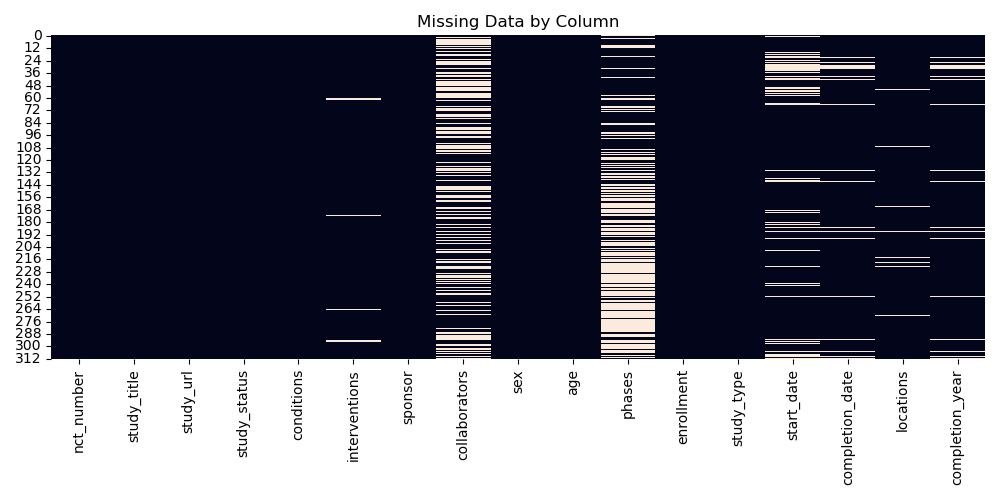
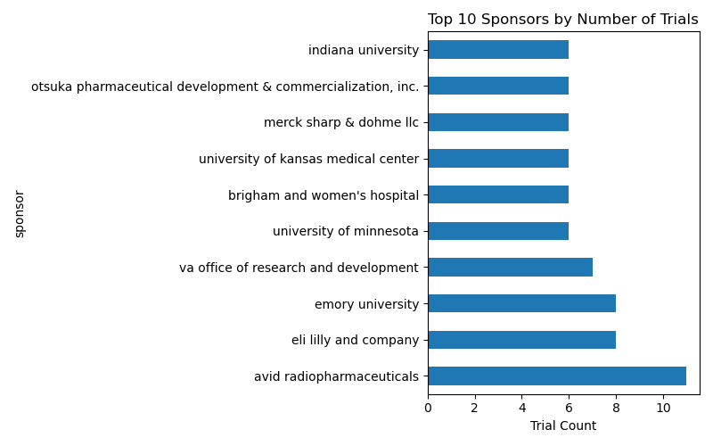
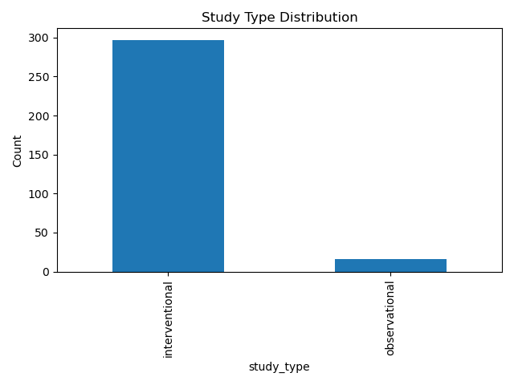
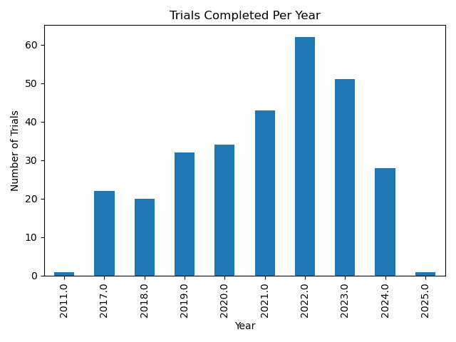

# 🧠 Alzheimer's Trials – EDA Summary Report

This is a quick overview of trends and patterns found in a set of 313 completed Alzheimer’s clinical trials pulled from ClinicalTrials.gov.

I focused on getting a general feel for who's running these trials, what types of studies are most common, how clean the data is, and when these trials were completed.

---

## 👀 Dataset at a Glance

- **Trials analyzed:** 313
- **Filter used:** Completed studies with statistical analysis plans
- **Source:** ClinicalTrials.gov export
- **Includes:** Sponsor names, study types, enrollment dates, and some demographics (age, sex, location — will look at later)

---

## 📌 Missing Data

I started with a heatmap to see which fields had gaps.

Most of the core fields are intact, but some of the extra details (like collaborators or locations) had missing values. Not too bad — definitely workable.

---

## 🏢 Who’s Running These Trials?

I looked at the top sponsors by number of studies.

No surprise — a mix of government orgs like the National Institute on Aging and big names like Eli Lilly. Mayo Clinic came out on top, which makes sense given the condition.

---

## 🔬 What Kind of Studies Are These?

Mostly **interventional trials** — so these are drug/device trials rather than observational research. That lines up with what you’d expect in pharma.

---

## 📆 When Were These Trials Happening?

The biggest wave of completions was between 2018–2021. Could reflect recent pushes in Alzheimer’s R&D, funding increases, or post-COVID trial activity bouncing back.

---

## ✅ What’s Next?

Still a few ideas I want to explore:
- Look at trial **phases** (e.g., how many are Phase 3?)
- Check **enrollment sizes**
- Compare **sponsors by phase or intervention type**
- Use `location` field to map where these trials were conducted

---

*Report by:* Moses Lian
*Date:* January 12, 2025

